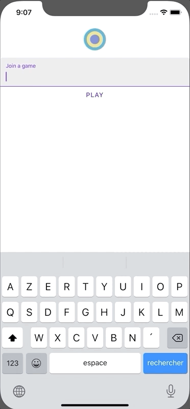
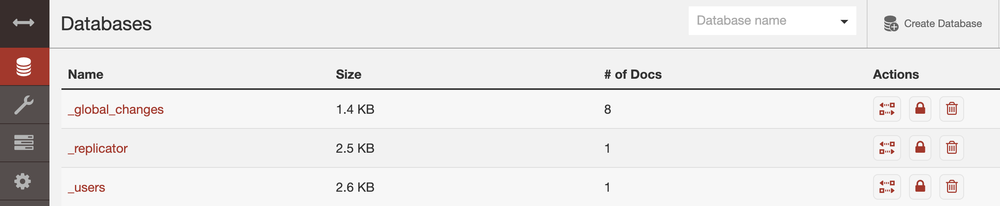
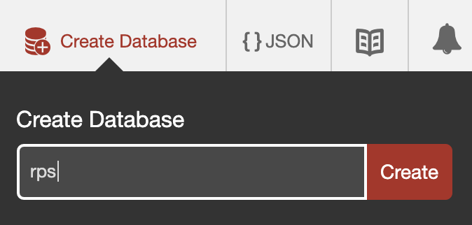
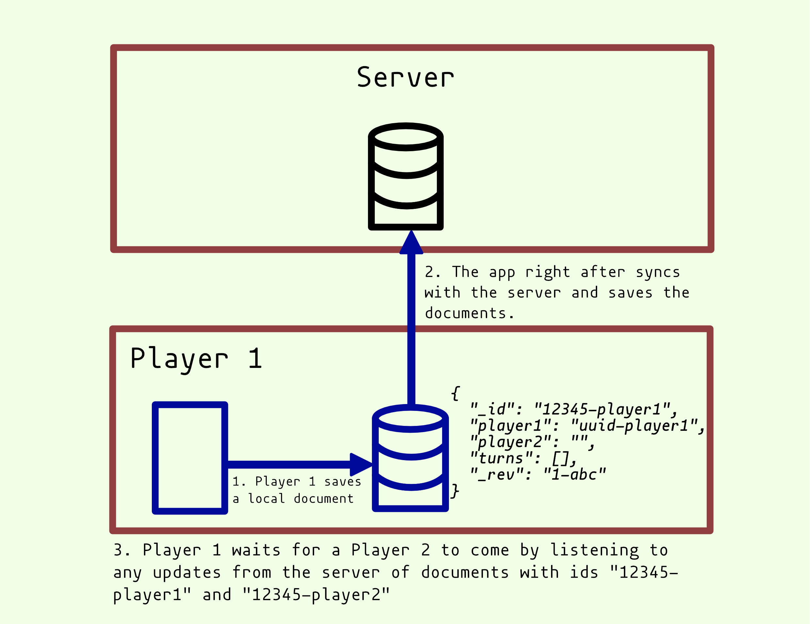
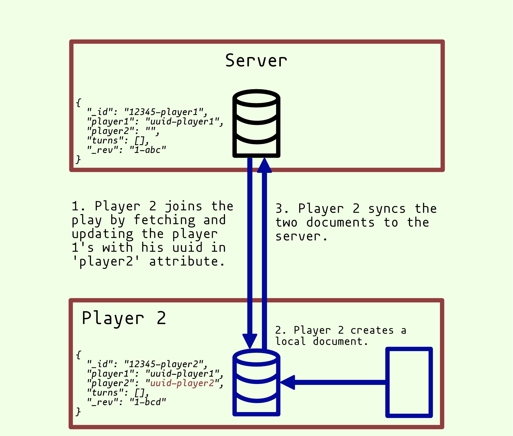
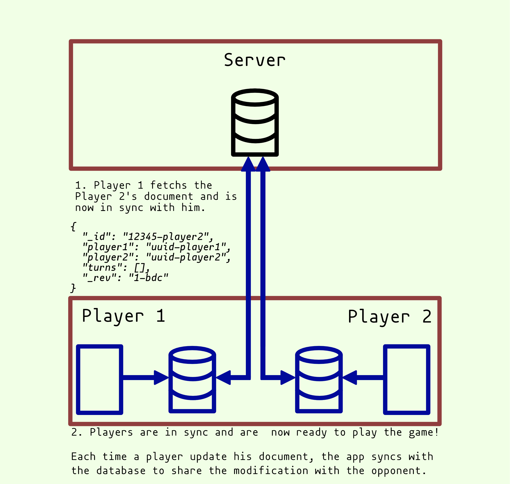

# Live sync in React Native with CouchDb

## Intro

In this tutorial, I will show you how to create a live game with data updating on multiple devices.

For this, let's make a game! A game where players can fight against each other in live. Let's make a live `Rock - Paper - Scissors` game. Well, it is already programmed [here](https://github.com/jcalixte/rnrps) so we only see cool stuff 😄.

This project is a perfect opportunity to see how to build live data syncs in React Native with CouchDb. Of course, there are many more use cases with these two technologies but it is a good start.

Thanks to CouchDb, we do not need to build any backend! At the end, we will have a React Native app connected to a local CouchDb database. With this game, we can focus on the essential parts: the live sync & update on our React component. Feel free to explore components to understand how it is displayed. Let's get ready!

## 1. Overview

### Rock-Paper-Scissors

What will do exactly our online game?

Two players will play the famous Rock-Paper-Scissors and join a game with its id. Other users will be able to join the game and be spectators. Theses games will update whenever a player plays a roud. Finally, we will display the score.

Here a quick demo of what a player will see.



First steps is to clone the [repo](https://github.com/jcalixte/rnrps), run the command `yarn`.

### What is CouchDb

Before getting deep into the app, it seems important to know the techology behind.

#### CouchDb

CouchDb is a NoSQL database accessible via a RESTFUL API. The particularity is that each update of a document (NoSQL data) is a new document linked to its previous versions by a common `_id`. Data in CouchDb are immutables. So, as in git, a historic tree can be made listing all the modification of a document. Each update creates a modification of the property `_rev` like `_rev: 12-ad32d26`, this is the version of the document (`_rev` is for `revision` 🤫).

CouchDb masters in database replications. As it is possible to know what has been modified by an `_id` and a `_rev` prop, it is easy for a database to know the delta and replicate from another one. What is important for us will be the replication of a distant database to a local one.

[CouchDb Documentation](https://docs.couchdb.org/en/stable/)

For our game we need to install it locally.

### Installation

To install CouchDb locally, go to their [website](https://docs.couchdb.org/en/latest/install/index.html). The install is really straightforward;

#### Configuration

Create a admin and configure CouchDb as a single node.

#### Create the `RPS` database

Then, go to the "Databases" tab and create de database called `rps`.





#### Install CouchDb in React Native

Simple! Only do a `yarn add pouchdb-react-native` and we're done!

#### PouchDb

If CouchDb is able to store data in a server, PouchDb helps us manipulate data in locale database. PouchDb is really close to CouchDb, indeed, they share the same API! This is really cool!

[PouchDb Documentation](https://pouchdb.com/guides/replication.html)

## Let's dive into the code!

### Sync

We want to share in real time a document `Play`. How to do so? We are going to replicate the local database and the database from the server. PouchDb has a really good method for it called `sync`. If there is one reason to use PouchDb, this is the `sync` method! Take a look at a quote from PouchDb documention:

> CouchDB was designed with sync in mind, and this is exactly what it excels at. Many of the rough edges of the API serve this larger purpose. For instance, managing your document revisions pays off in the future, when you eventually need to start dealing with conflicts.

It is used like this : `localDB.sync(remoteDB)`. Actualy, this method is a shortcut for :

```TypeScript
localDB.replicate.to(remoteDB);
localDB.replicate.from(remoteDB);
```

`sync` has options, and if we adapt it for our game we want:

- a live sync so we add the property `sync` to `true`,
- a synchronisation that persists and retry when there are connection problems. So we put the `retry` prop to `true`.
- We don't want to synchronise the whole database but only the current game! Hopefully, CouchDb and PouchDb can manage that for us with a [filtered replication](https://pouchdb.com/api.html#replication). There are many ways to do a filtered replication but the most efficient one is to give to `sync` the array of ids we want to listen to.

For more details, I suggest you see the excelent [PouchDb documentation](https://pouchdb.com/guides/replication.html#setting-up-sync)

So, if we see the whole code, here we have:

```TypeScript
// Repository/index.ts

public liveGame(id: string): void {
  this.cancelLive();
  const ids = [`${id}_${Player.Player1}`, `${id}_${Player.Player2}`];
  this.sync = this.local
    .sync<{}>(this.remote, {
      live: true,
      retry: true,
      doc_ids: ids,
    })
    .on('change', result => {
      console.log('change', result);
      bus.emit(SYNC_UP, {
        id,
        result,
      });
    });
}
```

In conclusion this is pretty simple and intuitive, isn't it?
We added an event `SYNC_UP` to make our `React` component reactive. We will listen to it later.

### Merge

In a game, each player will update his own document so we will not have to deal with conflicts. But our component just want to handle one document `Play` to display plays and scores. So we have a final work to do, we need to fetch the two documents in the database and merge them into one.

It is done in the file `PlayService.`, we can call this method `mergePlays` where we use a spread operator to merge the two documents. There is a little more work when we want to gather play turns in which each players update their moves. We loop through each `turn`, retrieve the move of the player 1 in the player 1's document and retrieve the move of the player 2 in the player 2's document. Like this:

```TypeScript
// PlayService.ts

private mergePlays(play1: IPlay | null, play2: IPlay | null): IPlay | null {
  if (!play1 || !play2) {
    return play1 || play2;
  }
  const play = {
    ...play1,
    ...play2,
  };
  const turnCount = Math.max(play1.turns.length, play2.turns.length);

  if (!turnCount) {
    play.turns = [];
  } else {
    play.turns = Array.from({length: turnCount}).map((_item, index) => {
      const turn1 = play1.turns[index];
      const turn2 = play2.turns[index];

      const player1 = turn1 ? turn1.player1 : null;
      const player2 = turn2 ? turn2.player2 : null;

      const turn: ITurn = {
        player1,
        player2,
        winner: null,
      };
      turn.winner = this.getWinner(turn);
      return turn;
    });
  }
  return play;
}
```

### The React Native component

After all these operations, it is finally time to display our game in screen. The code below is the page `Play` after the player submit the game id in the home page. We can init the liveGame; telling PouchDb to only sync the documents we need.

When fetching the play if there is no player 2, we join the play 🙂.

We can listen to changes by adding a listener to th `SYNC_UP` event from our PouchDb repository.

```tsx
// src/views/Play.tsx

const id = navigation.getParam('id') as string;
const [play, setPlay] = useState<IPlay | null>(null);

const getPlay = async () => {
  const playFromDb = await PlayService.get(id);
  setPlay(playFromDb);

  // ...

  if (playFromDb && !playFromDb.player2) {
    await PlayService.joinPlay(id, store.uuid);
  }
};

useEffect(() => {
  bus.on(SYNC_UP, getPlay);
  repository.liveGame(id);
  getPlay();

  return () => {
    bus.removeListener(SYNC_UP, getPlay);
  };
}, []);
```

## A picture is worth a thousand words

To summarize, here the 3 steps explained in pictures:

1. Player 1 creates the play
   - Player 1 saves a local document
   ```json
   {
     "_id": "12345-player1",
     "player1": "uuid-player1",
     "player2": "",
     "turns": [],
     "_rev": "1-abc"
   }
   ```
   - The app right after syncs with the server and saves the document
   - Player 1 waits for a Player 2 to come by listening to any updates from the server of documents with ids "12345-player1" and "12345-player2"



2. Player 2 joins the play
   - Player 2 joins the play by fetching and updating the player 1's with his uuid in 'player2' attribute.
   - Player 2 creates a local document
   ```json
   {
     "_id": "12345-player2",
     "player1": "uuid-player1",
     "player2": "uuid-player2",
     "turns": [],
     "_rev": "1-bcd"
   }
   ```
   - Player 2's app syncs with the database and saves the two documents



3. The play is ready
   - Player 1 gets the updates and is now ready to play the first round
   - Player 1 and player 2 save their document locally and then share them with the server. That way every player receive the update of their opponent.
   - The app merges the two documents into one so we can calculate who wins the round 1 and update the score.



## Conclusion

So we've completed our first live sync between two databases in React Native, awesome! There is so much more we can explore now. Here a few examples:

- create an offline first experience app to provide a seemless usage either the app is online or offline.
- create an app that share data in Bluetooth without the need of an Internet connection (like shareable books in region where Internet is expensive)
- create an app where people can collaborate in live.
- and so on...
