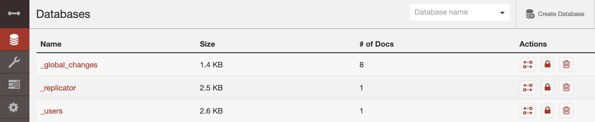
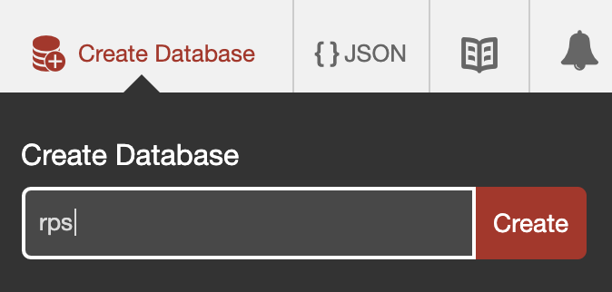

### Installation

To install CouchDb locally, go to their [website](https://docs.couchdb.org/en/latest/install/index.html). The install is really straightforward;

#### Configuration

Create a admin and configure CouchDb as a single node.

#### Create the `RPS` database

Then, go to the "Databases" tab and create de database called `rps`.

