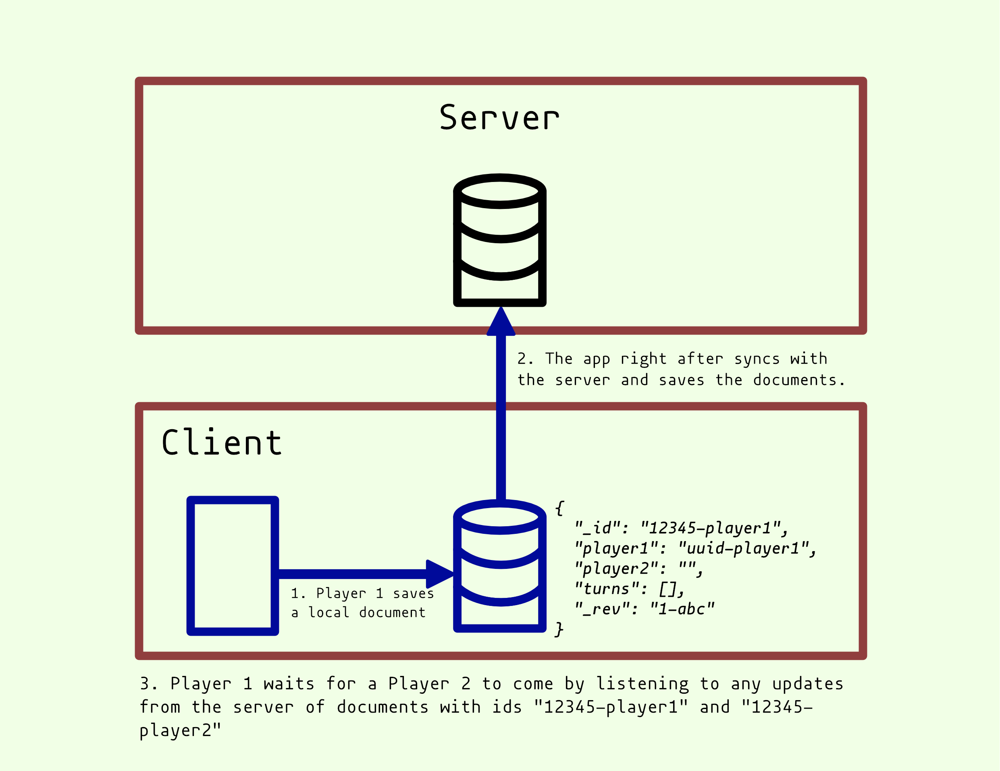

1. Player 1 creates the play
   - Player 1 saves a local document
   ```json
   {
     "_id": "12345-player1",
     "player1": "uuid-player1",
     "player2": "",
     "turns": [],
     "_rev": "1-abc"
   }
   ```
   - The app right after syncs with the server and saves the document
   - Player 1 waits for a Player 2 to come by listening to any updates from the server of documents with ids "12345-player1" and "12345-player2"



2. Player 2 joins the play
   - Player 2 joins the play by fetching and updating the player 1's with his uuid in 'player2' attribute.
   - Player 2 creates a local document
   ```json
   {
     "_id": "12345-player2",
     "player1": "uuid-player1",
     "player2": "uuid-player2",
     "turns": [],
     "_rev": "1-bcd"
   }
   ```
   - Player 2's app syncs with the database and saves the two documents
3. The play is ready
   - Player 1 gets the updates and is now ready to play the first round
   - Player 1 and player 2 save their document locally and then share them with the server. That way every player receive the update of their opponent.
   - The app merges the two documents into one so we can calculate who wins the round 1 and update the score.
